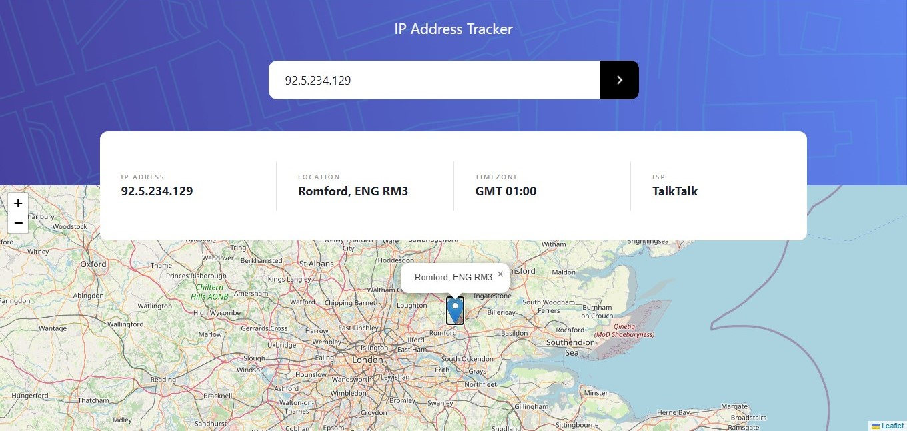

## 🌐 IP Adress Tracker

This project is a web app in which the user can get IP Address locations.
On reload, it returns the current user's IP and address.
Precision of the information may vary according to the info by the API provider, [Abstract](https://www.abstractapi.com/).

When running the project it's necessary to create a new API key in the provider's link above.

## ⚙️ Installation

1. Clone the latest code on the **develop** branch
2. Install dependencies
```
npm install
```
3. Compiles and hot-reloads for development - 
```
npm run serve
```

## 🛠️ Built With

- [Node.js](https://nodejs.org/en/download/)
- [NPM](https://www.npmjs.com/)
- [Vue.js](https://vuejs.org/)
- [Vue Leaflet](https://vue2-leaflet.netlify.app/)

## 🪟 Screenshot


##
#### This project is a solution to a challenge on [Frontend Mentor](https://www.frontendmentor.io/challenges/ip-address-tracker-I8-0yYAH0).
